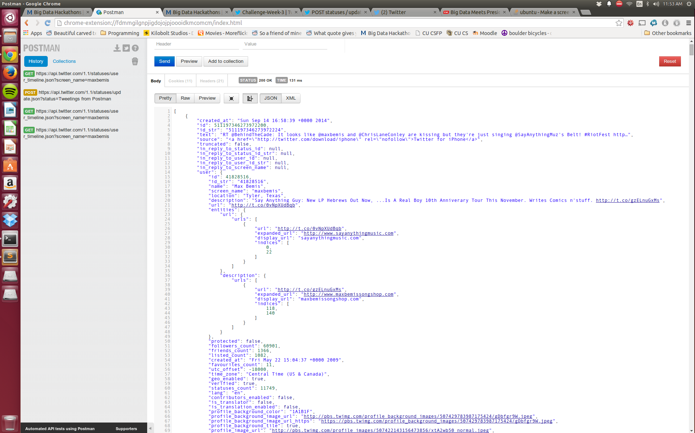
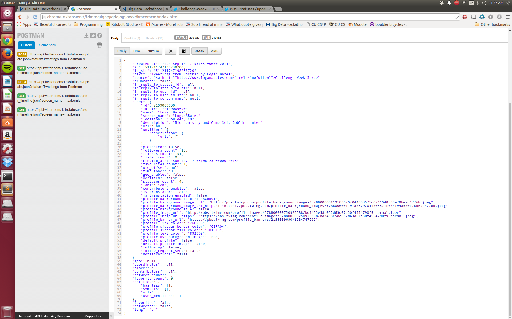
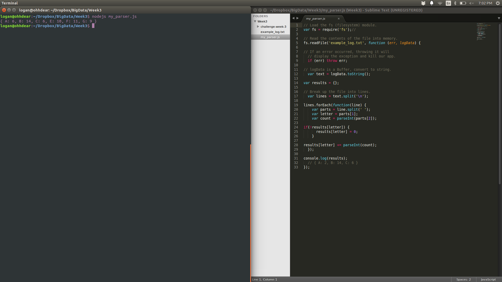
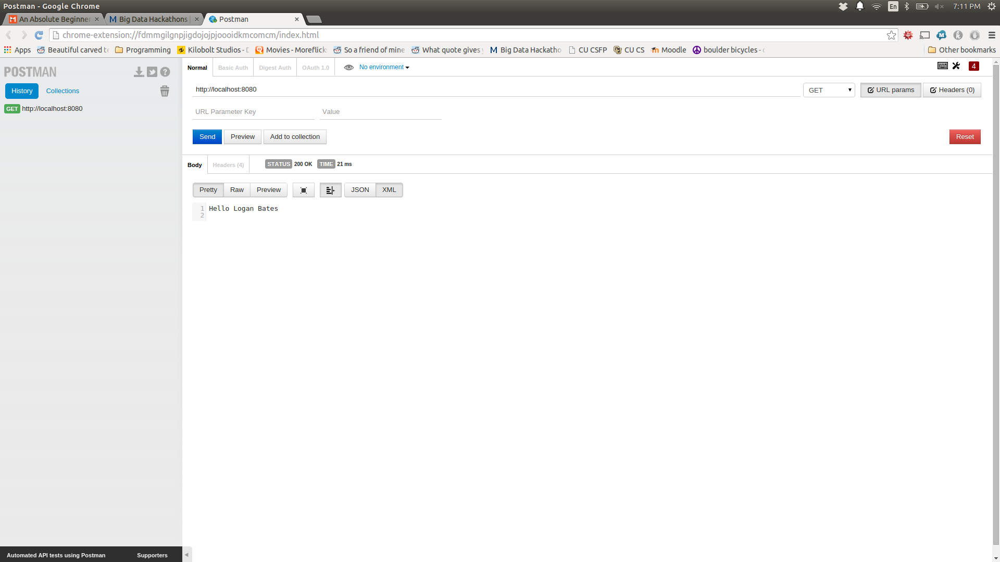
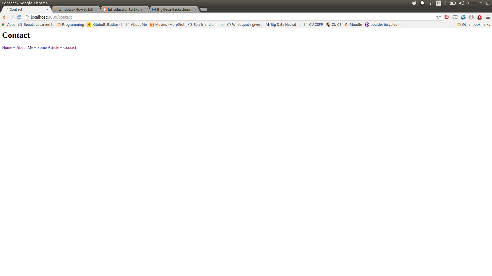
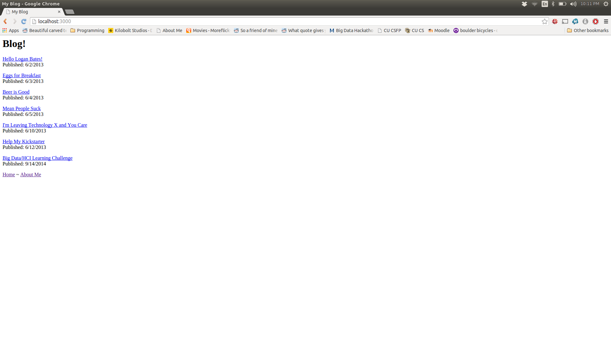
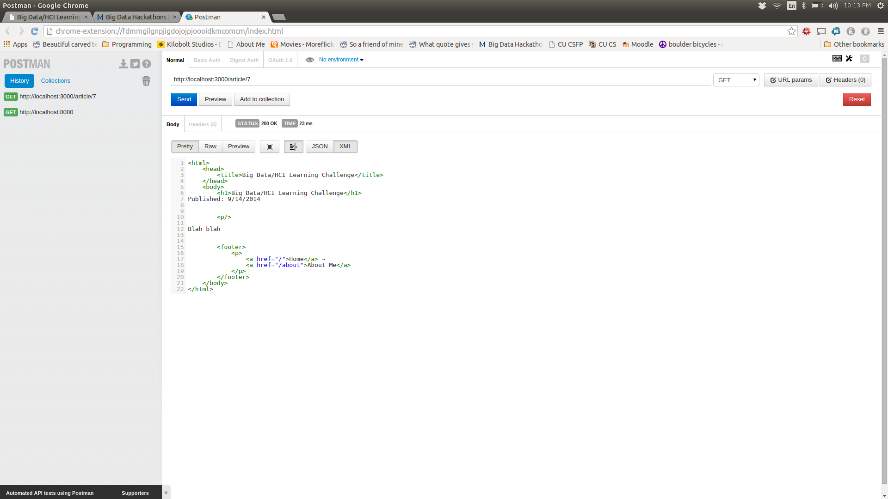
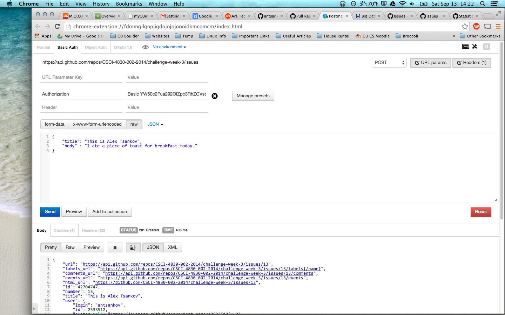

# Name

Alex Tsankov

# How many points have you earned?

100/100

(Make your own calculation and replace the number 0 with the points you think you've earned.)

# How many hours have you spent on this?

4.5

# Show and tell (4 points)

[Watch Detroit's Population Disappear In 4 Seconds](http://www.huffingtonpost.com/2014/03/07/detroit-population-gif_n_4913997.html)

# API (I) (4 points x 14 = 56 points)

## Checkpoints

### Checkpoint 1 (4 points)



### Checkpoint 2 (4 points)



### Checkpoint 3 (4 points)



### Checkpoint 4 (4 points)



### Checkpoint 5 (4 points)


### Checkpoint 6 (4 points)



### Checkpoint 7 (4 points)



### Checkpoint 8 (4 points)



## Challenges

### 1 (4 points)


### 2 (4 points)


### 3 (4 points)


### 4 (4 points)


### 5 (4 points)


### 6 (4 points)




# Splunk (III) (4 points x 10 = 40 points)

## Challenge 1

### Challenge 1-a (4 points)
```
NULL
```


### Challenge 1-b (4 points)
```
sourcetype="antsankov_TEST"
```


### Challenge 1-c (4 points)
```
sourcetype="antsankov_TEST" | stats count by typeRegex
```


### Challenge 1-d (4 points)
```
sourcetype="antsankov_TEST"| timechart count by typeRegex usenull=f useother=f
```


## Challenge 2

### Challenge 2-a (4 points)
```
sourcetype="antsankov_events" | stats count by actor.login
```


### Challenge 2-b (4 points)
```
sourcetype="antsankov_events" | timechart count by type
```


### Challenge 2-c (4 points)
```
sourcetype="antsankov_events" type = "PullRequestEvent" | top actor.login
```


### Challenge 2-d (4 points)
```
sourcetype="antsankov_events" type = "PullRequestEvent" | top payload.action
```


### Challenge 2-e (4 points)
```
sourcetype="antsankov_events" type = "PullRequestEvent" payload.action = "opened" | chart count by actor.login
```


### Challenge 2-f (4 points)
```
sourcetype="antsankov_events" type = "PullRequestEvent" repo.name="CSCI-4830-002-2014/challenge-week-2" | timechart count
```

