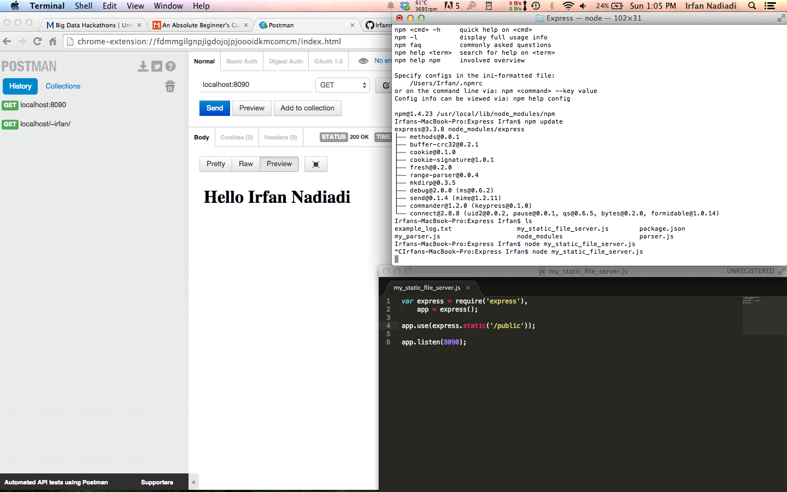
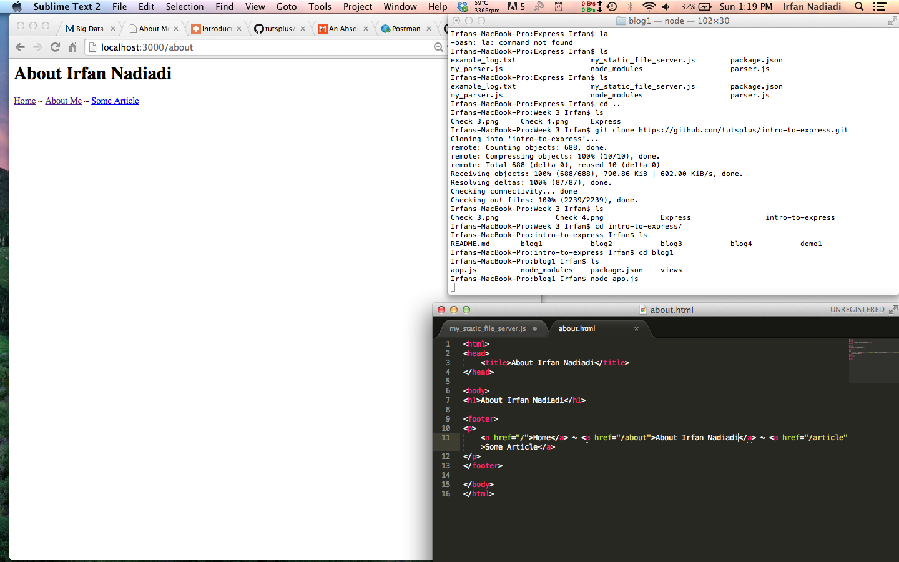

# Name

Irfan Nadiadi

# How many points have you earned?

100/100

# How many hours have you spent on this?

4.5

# Show and tell (4 points)

[Where the US gets its oil from](http://www.randalolson.com/2014/08/28/where-the-u-s-gets-its-oil-from/)

# API (I) (4 points x 14 = 56 points)

## Checkpoints

### Checkpoint 1 (4 points)


### Checkpoint 2 (4 points)


### Checkpoint 3 (4 points)


### Checkpoint 4 (4 points)



### Checkpoint 5 (4 points)



### Checkpoint 6 (4 points)


### Checkpoint 7 (4 points)


### Checkpoint 8 (4 points)


## Challenges

### 1 (4 points)


### 2 (4 points)


### 3 (4 points)


### 4 (4 points)


### 5 (4 points)


### 6 (4 points)


# Splunk (III) (4 points x 10 = 40 points)

## Challenge 1

### Challenge 1-a (4 points)
```
sourcetype=[??] [fill-in-the-rest]
```


### Challenge 1-b (4 points)
```
sourcetype=irfann1_events
```


### Challenge 1-c (4 points)
```
sourcetype=irfann1_events | stats count by type
```


### Challenge 1-d (4 points)
```
sourcetype=irfann1_events | timechart count by type
```


## Challenge 2

### Challenge 2-a (4 points)
```
sourcetype=course_github_events type=PushEvent | stats count by actor.login | sort -num(count)
```


### Challenge 2-b (4 points)
```
sourcetype=course_github_events | timechart count by type
```


### Challenge 2-c (4 points)
```
sourcetype=course_github_events type=PullRequestEvent | top actor.login
```


### Challenge 2-d (4 points)
```
sourcetype=course_github_events type=PullRequestEvent | stats count by payload.action
```


### Challenge 2-e (4 points)
```
sourcetype=course_github_events type=PullRequestEvent | stats count by actor.login
```


### Challenge 2-f (4 points)
```
sourcetype=course_github_events type=PullRequestEvent repo.name="CSCI-4830-002-2014/challenge-week-2" | timechart count
```

